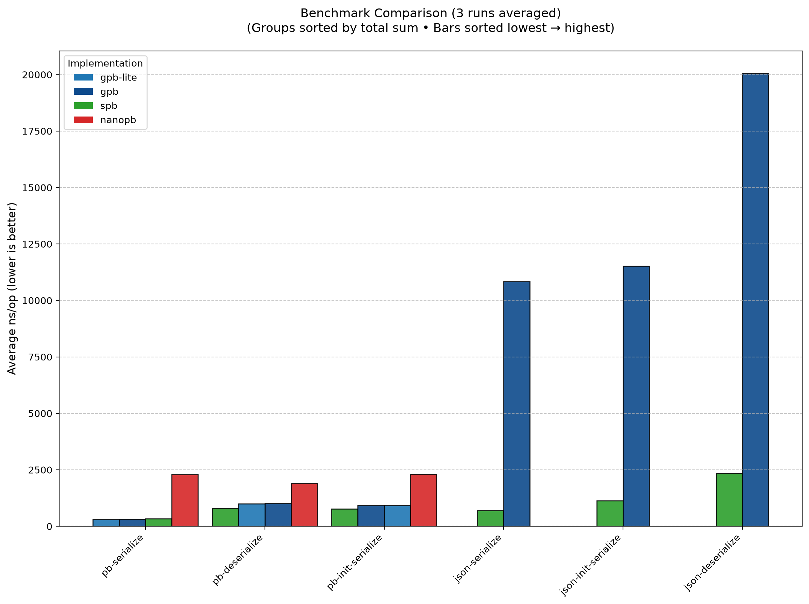

# simple-protobuf

[](https://opensource.org/licenses/MIT)
[](https://en.cppreference.com/w/cpp/20)
[](https://cmake.org/)
[](https://github.com/tonda-kriz/simple-protobuf/actions/workflows/ci-linux-tests.yml)
[](https://github.com/tonda-kriz/simple-protobuf/actions/workflows/ci-windows-tests.yml)
[](https://github.com/tonda-kriz/simple-protobuf/actions/workflows/ci-macos-tests.yml)
[](https://tonda-kriz.github.io/simple-protobuf/library)

**Lightweight C++ protobuf & JSON serialization library** 
 - _Where **simplicity** meets **usability**_
 - Fast as [Google Protocol Buffers](https://github.com/protocolbuffers/protobuf), small as [nanopb](https://github.com/nanopb/nanopb)
 - Without **protoc** and without **Google toolchain** dependency

### Usage

1. Define your data in standard `.proto` files.
2. Generate clean, native C++ structs.
3. Serialize/deserialize to `protobuf` (GPB-wire-compatible) and `JSON` (GPB-compatible) with minimal effort.

### Example

```proto
// proto/person.proto, hand written
package PhoneBook;

message Person {
  optional string name = 1;
  optional int32 id = 2;  // Unique ID number for this person.
  optional string email = 3;

  enum PhoneType {
    MOBILE = 0;
    HOME = 1;
    WORK = 2;
  }

  message PhoneNumber {
    required string number = 1; // phone number is always required
    optional PhoneType type = 2;
  }

  // all registered phones
  repeated PhoneNumber phones = 4;
}
```

```bash
# CMakeLists.txt, hand written
add_subdirectory(external/simple-protobuf) # or FetchContent
add_executable(myapp main.cpp proto/person.proto)
spb_protobuf_generate(TARGET myapp)
```

```CPP
// proto/person.pb.h, generated
namespace PhoneBook
{
struct Person {
    enum class PhoneType : int32_t {
        MOBILE = 0,
        HOME   = 1,
        WORK   = 2,
    };
    struct PhoneNumber {
        // phone number is always required
        std::string number;
        std::optional<PhoneType> type;
    };
    std::optional<std::string> name;
    // Unique ID number for this person.
    std::optional<int32_t> id;
    std::optional<std::string> email;
    // all registered phones
    std::vector<PhoneNumber> phones;
};
} // namespace PhoneBook
```

```CPP
// main.cpp, hand written
#include <iostream>
#include <proto/person.pb.h>   // <- generated

int main() {
    const auto john = phonebook::Person{
        .name   = "John Doe",
        .id     = 1234,
        .email  = "john@example.com",
        .phones = {{.number = "123456789", .type = phonebook::Person::PhoneType::MOBILE}}
    };

    // JSON round-trip
    const auto json = spb::json::serialize<std::string>(john);
    std::cout << "JSON:\n" << json << "\n\n";

    // Protobuf binary round-trip
    const auto pb_bytes = spb::pb::serialize<std::vector<std::byte>>(john);

    const auto decoded_json = spb::json::deserialize<phonebook::Person>(json);
    const auto decoded_pb = spb::pb::deserialize<phonebook::Person>(pb_bytes);

    // All equal: john == decoded_json == decoded_pb
}
```

## Features

* No `protoc` or `Google libs` dependency - instead it uses its own proto-compiler called `sprotoc`.
* Supports `.proto` files with `proto2` or `proto3` syntax (no edition syntax).
* Generates clean, modern C++ with `std::optional`, `std::vector`, and `enum class`.
* Bundles protobuf and JSON support in a single library.
    * Serialized protobuf and JSON are compatible with [Google Protocol Buffers](https://github.com/protocolbuffers/protobuf), Python, Go, Java.
* Embedded-friendly, zero heap allocations when used with fixed-size strings/bytes/arrays.
  * Supports options
    * `max_count` for repeated and `max_size` for bytes/string
    * Can use user types for string/bytes/repeated..., for [example](example/generated/etl.pb.h) [ETL](https://github.com/ETLCPP/etl) 
    * See [options](doc/options.md) for user-specified types and advanced usage.

## Dependencies

* C++ compiler with C++20 support
* CMake
* Standard C++ library
* *(optional) clang-format for code formatting*

## Type mapping

| proto type | CPP type | GPB encoding |
|------------|----------|--------------|
| `bool`     | `bool` | varint |
| `float`    | `float` | 4 bytes |
| `double`   | `double` | 8 bytes |
| `int32`    | `int32_t` | varint |
| `sint32`   | `int32_t` | zig-zag varint |
| `uint32`   | `uint32_t` | varint |
| `int64`    | `int64_t` | varint |
| `sint64`   | `int64_t` | zig-zag varint |
| `uint64`   | `uint64_t` | varint |
| `fixed32`  | `uint32_t` | 4 bytes |
| `sfixed32` | `int32_t` | 4 bytes |
| `fixed64`  | `uint64_t` | 8 bytes |
| `sfixed64` | `int64_t` | 8 bytes |
| `string`   | `std::string` | UTF-8 string |
| `bytes`    | `std::vector<std::byte>` | base64 encoded in JSON |
| `message`  | `struct` | length delimited |
| `enum`     | `enum class` | varint |
| `map`      | `std::map<,>` | |
| `oneof`    | `std::variant<>` | |

| proto type modifier | CPP type modifier | Notes |
|---------------------|-------------------|-------|
| `optional`          | `std::optional<Message>` | |
| `optional`          | `std::unique_ptr<Message>` | for cyclic message dependencies (A -> B, B -> A) |
| `repeated`          | `std::vector<Message>` | |

See also [options](doc/options.md) for user-specified types and advanced usage.

## Examples

See the [example](example/) directory.

## Doc

* [API](doc/API.md)
* [Options](doc/options.md)
* [deepwiki](https://deepwiki.com/tonda-kriz/simple-protobuf)

## Performance benchmark

_Fast as [Google Protocol Buffers](https://github.com/protocolbuffers/protobuf), small as [nanopb](https://github.com/nanopb/nanopb)_

Measured on `Linux/i7-8650U CPU @ 1.90GHz` with GCC 16.1.1 `-flto -O2` using [nanobench](https://github.com/martinus/nanobench).

See the [benchmark](benchmark/) directory.

### Speed

* SPB protobuf serializer/deserializer has about the **same speed** as [Google Protocol Buffers](https://github.com/protocolbuffers/protobuf).
* SPB JSON serializer/deserializer is about **8x faster** than [Google Protocol Buffers](https://github.com/protocolbuffers/protobuf).



### Binary size

Measured on stripped executable files
```bash
$ find build/benchmark -type f -executable -exec strip --strip-all {} +
$ ls -alh ./build/benchmark
```

* SPB has about the **same code size** as [nanopb](https://github.com/nanopb/nanopb), which makes it ideal for Embedded systems.


## Status

* [x] Make it work
* [x] Make it right
* [x] Make it fast

## Roadmap

* [x] Parser for proto files (supported syntax: `proto2` and `proto3`)
* [x] Compile proto messages to C++ data structs
* [x] JSON de/serializer for generated C++ data structs (serialized JSON is GPB-compatible)
* [x] Protobuf de/serializer for generated C++ data structs (serialized protobuf is GPB-compatible)
* [x] Implement options and user-specified types/containers
* [x] Benchmarks for size and speed, direct comparison with other libraries (official protobuf, nanopb)

## Missing features

* gRPC is not implemented
